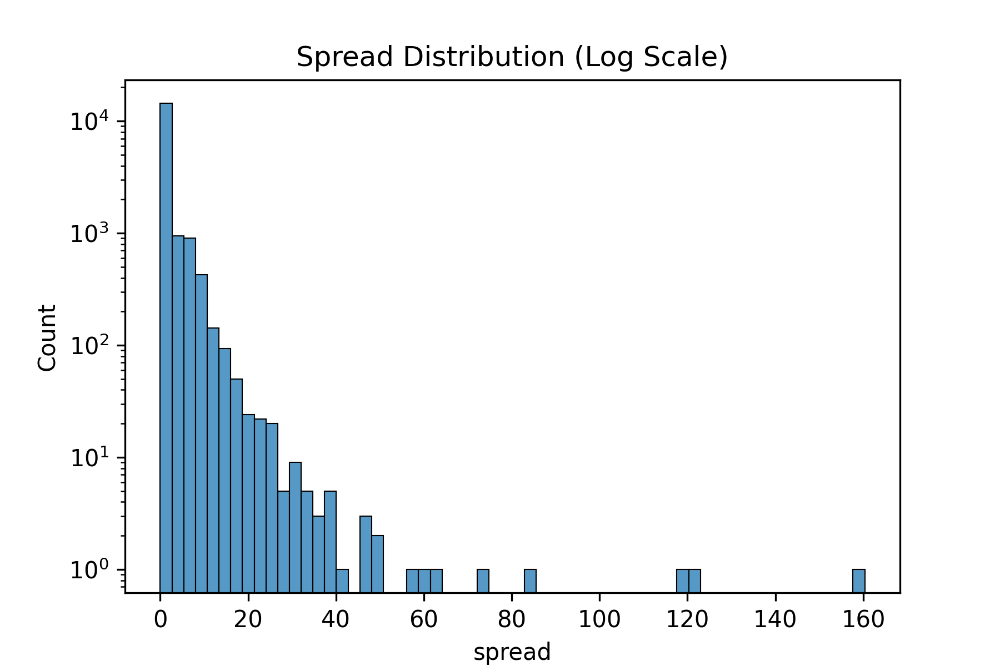

# 📈 Financial Time Series Analysis

<p align="center">

</p>


A quantitative analysis of **market microstructure dynamics** using high-frequency cryptocurrency market data.

This project investigates relationships between **liquidity, volatility, and trading activity**, which are core concepts in financial market microstructure and quantitative finance.

---

# 📌 Research Objectives

This project explores the following questions:

* How does **market volatility affect bid-ask spreads**?
* Does **trading activity influence market liquidity**?
* Do high-frequency markets exhibit **volatility clustering**?
* How are **spread, volatility, and trade intensity related**?

---

# 📊 Dataset

The dataset contains **high-frequency cryptocurrency market data** including:

* Bid-ask spread
* Midpoint prices
* Order book depth
* Bid/ask market notional values
* Trade activity

---

# 📈 Feature Engineering

Three core market microstructure variables were constructed:

| Feature | Description | Financial Interpretation |
|------|------|------|
| **spread** | Bid-ask spread | Liquidity measure |
| **rolling_vol** | Rolling standard deviation of returns | Market volatility |
| **trade_intensity** | Rolling trade activity proxy | Market activity |

These features are widely used in **quantitative finance and microstructure research**.

---

# 📊 Feature Statistics

| Metric | Spread | Rolling Volatility | Trade Intensity |
|------|------|------|------|
| Mean | 1.29 | 0.00084 | 50 |
| Median | 0.01 | 0.00070 | 50 |
| Max | 160.36 | 0.0106 | 50 |

The distribution of spreads shows **heavy right-skew**, with most spreads near zero but occasional extreme spikes.

---

# 📊 Visualizations

## Spread vs Rolling Volatility

<p align="center">

</p>

---

## Spread vs Trade Intensity

<p align="center">

</p>

---

## Rolling Volatility Over Time

<p align="center">

</p>

---

## Feature Correlation Heatmap

<p align="center">

</p>

---

## Spread Distribution (Log Scale)

<p align="center">

</p>

The log-scaled histogram highlights the **heavy-tailed nature of spreads**, where extreme spread events occur infrequently but can be very large.

---

# 📊 Key Findings

### 1️⃣ Spread–Volatility Relationship

The correlation between **bid-ask spread and rolling volatility is 0.43**.

This indicates that **liquidity providers widen spreads during periods of higher market risk**, which is consistent with market microstructure theory.

---

### 2️⃣ Spread and Trading Activity

The correlation between **spread and trade intensity is 0.40**, suggesting that changes in trading activity are associated with shifts in liquidity conditions.

---

### 3️⃣ Volatility and Market Activity

A strong correlation of **0.89 between rolling volatility and trade intensity** indicates that periods of **high trading activity tend to coincide with increased market volatility**.

---

### 4️⃣ Spread Distribution

The distribution of spreads is **highly right-skewed**:

* Median spread: **0.01**
* Mean spread: **1.29**
* Maximum spread: **160.36**

Most spreads remain extremely small under normal market conditions, but rare market events produce **significantly wider spreads**, reflecting temporary liquidity deterioration.

---

# 📂 Project Structure

```
financial_time_series_analysis
│
├── notebooks
│   └── 01_exploratory_analysis.ipynb
│
├── data
│   ├── raw
│   └── processed
│
├── reports
│   └── figures
│       ├── spread_vs_volatility.png
│       ├── spread_vs_trade_intensity.png
│       ├── volatility_time_series.png
│       ├── correlation_heatmap.png
│       └── spread_distribution_log.png
│
├── src
│   └── data_processing.py
│
├── requirements.txt
└── README.md
```

---

# 🛠️ Tools & Libraries

* Python
* Pandas
* NumPy
* Matplotlib
* Seaborn
* Jupyter Notebook

---

# 🚀 Possible Extensions

Future improvements could include:

* **Volatility forecasting using GARCH models**
* Machine learning models for **spread prediction**
* Order book imbalance features
* Liquidity prediction models
* High-frequency trading signal analysis

---

# 👤 Author

**Pranav Jindal**

---

# ⭐ If you found this project interesting

Consider **starring the repository** to support the work.
