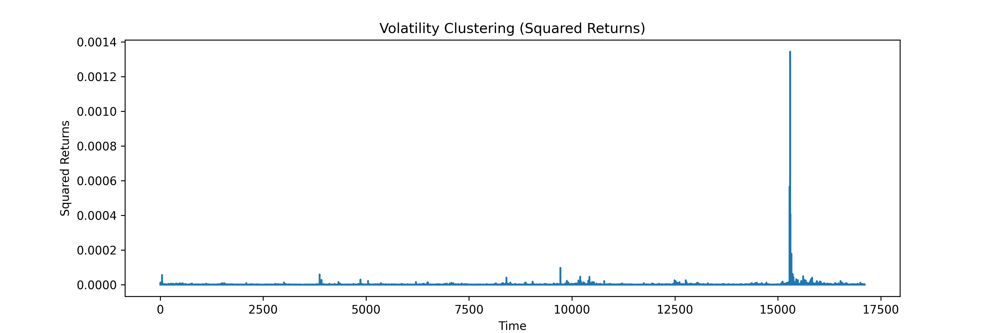

# Financial Time Series Analysis

A quantitative analysis of high-frequency cryptocurrency market data, focused on three relationships that matter in real trading: how volatility affects liquidity, how trading activity shifts spreads, and whether volatility clusters over time.

The short answer to all three: yes, measurably.

---

## What this project investigates

Four questions drove the analysis:

- Do bid-ask spreads widen when volatility rises?
- Does trading activity affect liquidity conditions?
- Do high-frequency crypto markets show volatility clustering?
- How are spread, volatility, and trade intensity related to each other?

---

## Dataset

High-frequency cryptocurrency market data including bid-ask spreads, midpoint prices, order book depth, bid/ask notional values, and trade activity records.

---

## Feature Engineering

Three microstructure variables were constructed from raw data:

| Feature | What it measures |
|---|---|
| `spread` | Bid-ask spread — the primary liquidity proxy |
| `rolling_vol` | Rolling standard deviation of returns — market volatility |
| `trade_intensity` | Rolling trade activity — how active the market is at any moment |

These are standard inputs in quantitative finance and microstructure research. The goal was to see how they move relative to each other, not to predict price.

---

## What the data showed

**Spread–Volatility: correlation 0.43**


When market risk rises, liquidity providers widen their spreads. This is exactly what microstructure theory predicts — and the data confirms it. The relationship isn't perfect (0.43, not 0.9), but it's consistent enough to be operationally meaningful.

---

**Spread–Trade Intensity: correlation 0.40**


Higher trading activity is associated with wider spreads. This runs counter to the naive intuition that more trading means better liquidity — in high-frequency markets, activity spikes often reflect uncertainty, not confidence.

---

**Volatility–Trade Intensity: correlation 0.89**


This is the strongest finding. Periods of high trading activity and periods of high volatility are nearly inseparable in this dataset. They don't just correlate — they move together. For anyone building a volatility signal from order flow data, this relationship is worth paying attention to.

---

**Spread distribution: heavily right-skewed**


| Metric | Value |
|---|---|
| Median spread | 0.01 |
| Mean spread | 1.29 |
| Max spread | 160.36 |

Under normal conditions, spreads are tiny. But rare events — liquidity stress, market imbalance, large directional moves — push spreads to extremes that pull the mean well above the median. The heavy tail isn't noise; it's the signal.

---

**Volatility clustering**



Plotting squared returns over time shows clear clustering — volatile periods follow volatile periods. This is a well-documented phenomenon in financial time series and shows up cleanly in this data.

---

**Feature Correlation Heatmap**


---

## Key Statistics

| Metric | Value |
|---|---|
| Mean Spread | 1.29 |
| Spread Std Dev | 4.00 |
| Mean Rolling Volatility | 0.000842 |
| Spread–Volatility Correlation | 0.43 |
| Spread–Trade Intensity Correlation | 0.40 |
| Volatility–Trade Intensity Correlation | 0.89 |

---

## Project Structure

```
financial_time_series_analysis/
├── notebooks/
│   └── 01_exploratory_analysis.ipynb
├── data/
│   ├── raw/
│   └── processed/
├── reports/
│   └── figures/
│       ├── spread_vs_volatility.png
│       ├── spread_vs_trade_intensity.png
│       ├── volatility_time_series.png
│       ├── correlation_heatmap.png
│       ├── spread_distribution.png
│       └── volatility_clustering.png
├── src/
│   └── data_processing.py
├── requirements.txt
└── README.md
```

---

## Stack

Python, Pandas, NumPy, Matplotlib, Seaborn, Jupyter Notebook

---

## Where this could go

A few natural extensions:

- **GARCH modeling** — the volatility clustering finding is a direct setup for GARCH. Fitting a GARCH(1,1) to this data would quantify the clustering and produce volatility forecasts
- **Order book imbalance signals** — the depth data is already in the dataset; using it to predict short-term spread changes is a tractable next step
- **Spread prediction models** — the 0.43 and 0.40 correlations are weak enough that a linear model won't work well, but tree-based models on lagged features might
- **Regime detection** — the heavy-tailed spread distribution suggests distinct market regimes (normal vs stress). Clustering on microstructure features to identify those regimes would be worth exploring

---

*Author: Pranav Jindal*
