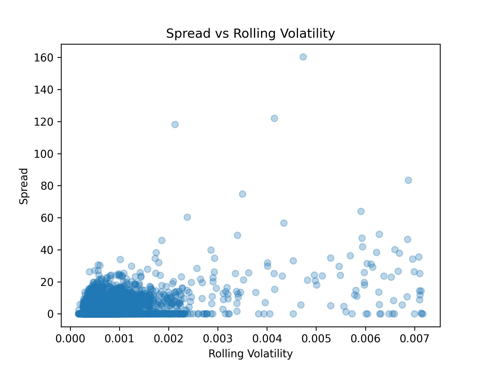
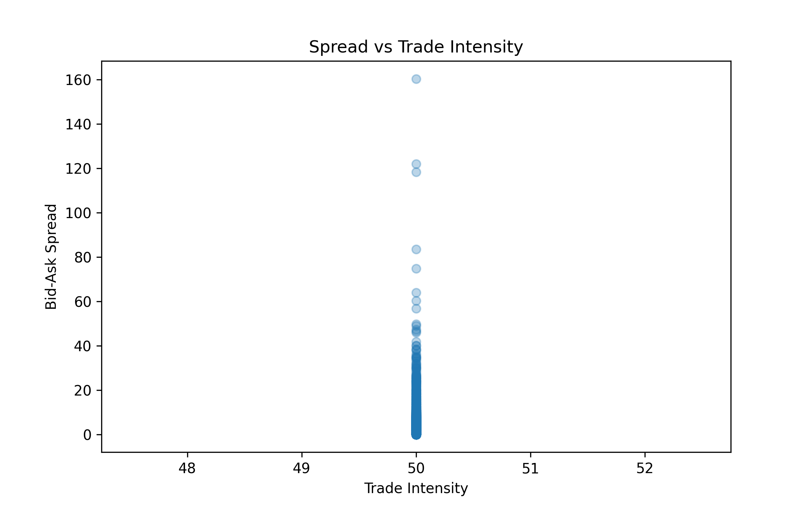
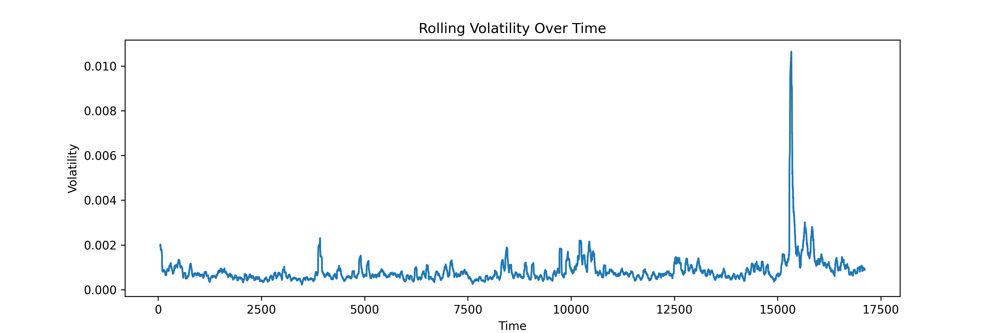
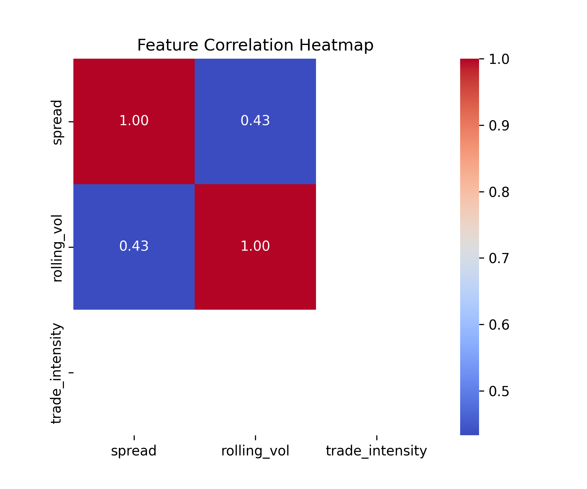

# 📈 Financial Time Series Analysis

Quantitative analysis of **market microstructure dynamics** using high-frequency cryptocurrency data.

This project explores relationships between:

* Bid-ask spread
* Market volatility
* Trade intensity
* Liquidity dynamics

The analysis demonstrates key financial phenomena such as **volatility clustering** and **spread-volatility relationships**.

---

# 🧠 Key Research Questions

* How does **market volatility affect bid-ask spreads**?
* Does **trade intensity influence liquidity**?
* Do high-frequency returns exhibit **volatility clustering**?

---

# 📊 Example Visualizations

## Spread vs Rolling Volatility

<p align="center">

</p>

---

## Spread vs Trade Intensity

<p align="center">

</p>

---

## Volatility Over Time

<p align="center">

</p>

---

## Feature Correlation

<p align="center">

</p>

---

# 📂 Project Structure

```
financial_time_series_analysis
│
├── notebooks
│   └── 01_exploratory_analysis.ipynb
│
├── src
│   └── data_processing scripts
│
├── data
│   ├── raw
│   └── processed
│
├── reports
│   └── figures
│       ├── spread_vs_volatility.png
│       ├── spread_vs_trade_intensity.png
│       ├── volatility_time_series.png
│       └── correlation_heatmap.png
│
├── requirements.txt
└── README.md
```

---

# 🔬 Key Insights

* Bid-ask spreads widen during **periods of higher volatility**.
* Higher trading intensity can correspond with **tighter spreads**.
* High-frequency crypto data shows **volatility clustering**, a well-known property of financial markets.

---

# 🛠️ Tools Used

* Python
* Pandas
* NumPy
* Matplotlib
* Seaborn
* Jupyter Notebook

---

# 🚀 Possible Extensions

* Volatility forecasting using **GARCH models**
* Liquidity prediction models
* Market microstructure feature engineering
* Machine learning models for spread prediction

---

# 👤 Author

**Pranav Jindal**

Aspiring quantitative researcher interested in financial markets, data science, and algorithmic trading.

